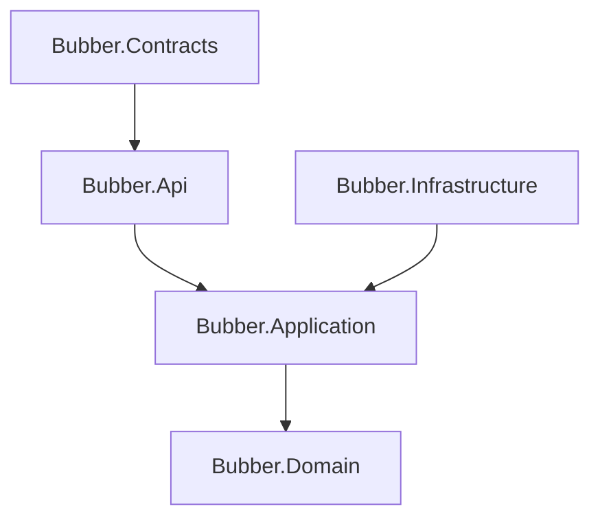

# Buber Dinner

The model following Clean Architecture

## Entities
Menu
Dinner 
Host
Guest
User
Reservation
Bill
Menu Review
Guest Rating

### Relationship Entities 

1. Menu 
1 Host 
n Dinner 
n Menu Review

2. Dinner 
1 Host 
1 Menu 
n Reservation

3. Host 
n Menu 
n Dinner
1 User 

4. Guest 
n Reservation
n Bill 
n Menu Review 
n Guest Rating

5. User 
1 Host 
1 Guest 

6. Reservation
1 Dinner 
1 Guest 

7. Bill 
1 Dinner 
1 Guest 

8. Menu Review
1 Menu 
1 Host
1 Guest

9. Guest Rating 
1 Dinner 
1 Host 
1 Guest 

### Aggregate

1. Menu 
   - HostId
   - DinnerId []
   - MenuReviewId []

2. Dinner 
  - HostId 
  - MenuId 
  - Reservation []
    - DinnerId 
    - GuestId 
    - BillId

3. User 
   - HostId 
   - GuestId 
  
4. Host 
   - MenuId []
   - DinnerId []
   - UserId 

5. Guest 
   - DinnerId []
   - BillId []
   - MenuReviewId []
   - GuestRating []
     - DinnerId 
     - HostId 
  - UserId 

6. Bill 
   - DinnerId 
   - GuestId 

7. MenuReview 
   - MenuId 
   - HostId
   - GuestId